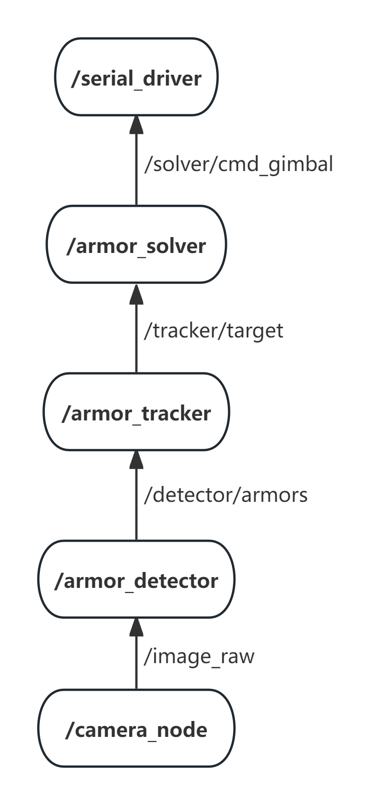

<<<<<<< HEAD
# XUM-RM-AIM
=======
# RCS2025 RM_VISION

厦门大学RCS战队25赛季视觉项目仓库，该项目在原rm_vision项目的基础上，结合其他队伍优秀开源进行扩展。

## 一、项目介绍

### 结构

```bash
.
│
├── rm_vision (启动及参数文件)
│
├── rm_gimbal_description (机器人云台urdf文件，坐标系的定义)
│
├── rm_auto_aim
|   |
│   ├── armor_detector (装甲板识别器)
│   │
│   ├── armor_tracker (整车估计)
│   │
│   |── armor_solver (弹道解算、火控)
|   │
|   └── auto_aim_interfaces (自定义msg)
│
├── hik-camera (hik相机驱动)
│
└── rm_serial_driver (串口，下位机通信)
```

### 框架

<p align="center">
  
</p>

## 二、环境配置

当前开发环境为

- Ubuntu22.04
- ROS2 humble

### 第三方库

- abseil-cpp

  ```bash
  git clone https://github.com/abseil/abseil-cpp.git
  cd abseil-cpp
  mkdir build
  cd build
  cmake ..
  make -j6
  sudo make install
  ```

- ceres-solver 2.1.0

  ```bash
  sudo apt install libgoogle-glog-dev libatlas-base-dev libeigen3-dev
  
  git clone https://github.com/ceres-solver/ceres-solver.git
  cd ceres-solver
  git checkout 2.1.0
  # 同上
  ```

- sophus 1.24.6

  ```bash
  git clone -b tags/1.24.6 https://github.com/strasdat/Sophus.git
  # 同上
  ```

- g2o

  ```bash
  git clone https://github.com/RainerKuemmerle/g2o.git
  # 同上
  ```

### 依赖

```bash
rosdep install --from-paths src --ignore-src -r -y
```

## 三、运行

修改`src/rm_vision/rm_vision_bringup/config/node_params.yaml`中的参数，参数含义参考yaml注释、各功能包的README或是源码

```bash
# 编译
colcon build --symlink-install --cmake-args -DCMAKE_BUILD_TYPE=Release

# 运行
source install/setup.bash
ros2 launch rm_vision_bringup vision_bringup.launch.py
```

## 四、自启动

确保串口具有永久权限，**将下面的`<username>`替换成自己的用户名**

```bash
sudo usermod -aG dialout <username>
```

在Ubuntu自带的Startup Applications应用中添加启动脚本，command为`gnome-terminal -x /path/to/startup.bash`，**将`/path/to/startup.bash`替换成`starup.bash`的正确路径**

## 致谢

感谢以下开源项目：

- [rm_vision](https://gitlab.com/rm_vision)，提供一个规范、易用、鲁棒、高性能的视觉框架方案
- [上海交通大学步兵自瞄](https://www.bilibili.com/video/BV1vX4y1W7U7/?spm_id_from=333.337.search-card.all.click&vd_source=cedcfac26162d6395214c6b86c7f02f0)，提供了装甲板姿态解算优化思路
- [中南大学24赛季视觉项目](https://github.com/CSU-FYT-Vision/FYT2024_vision/tree/main?tab=readme-ov-file)，提供了装甲板姿态解算优化器、弹道解算、自瞄选板
- [深北莫北极熊战队hik驱动](https://github.com/SMBU-PolarBear-Robotics-Team/hik_camera),提供相机帧率设置方法和采样格式修改方法

>>>>>>> 90a2a89 (加了串口包中resetTracker函数以及主要函数的注释)
